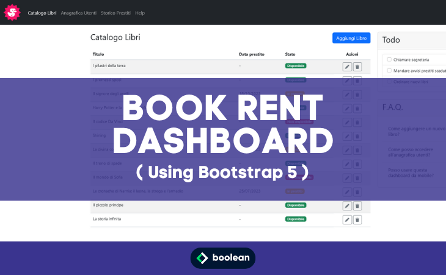

 
Quindicesimo Esercizio Classe #137 - Boolean

---

Studente: Fabio Ferrero

---
# English

## Target of the project:
Recreate the responsive layout of a dashboard, i.e., the control panel of a hypothetical web application, following the attached screenshots.
The request is to implement it using Bootstrap 5.

<strong>Bonus:</strong>
Add the sidebar sidebar components as from the screenshots attached to the resource.

---
# Italiano

## Obiettivo del progetto:
Ricreare il layout responsive di una dashboard, ovvero il pannello di controllo di una ipotetica applicazione web, seguendo gli screenshot allegati.
La richiesta è di realizzarlo utilizzando Bootstrap 5.

<strong>Bonus:</strong>
Aggiungere i componenti della sidebar laterale come dagli screenshot allegati alla risorsa.

---

---
All'interno della repo sono hostati gli screenshot forniti per la creazione del codice.